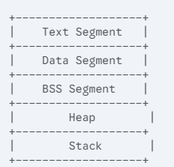
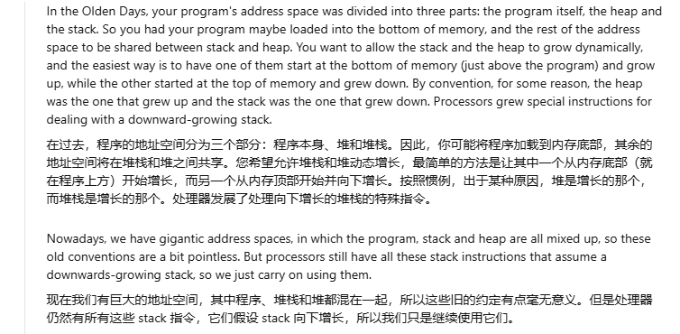
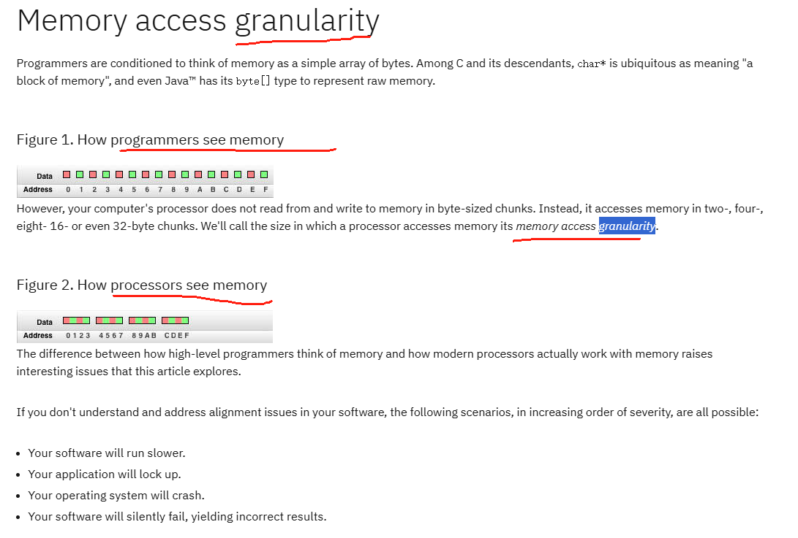
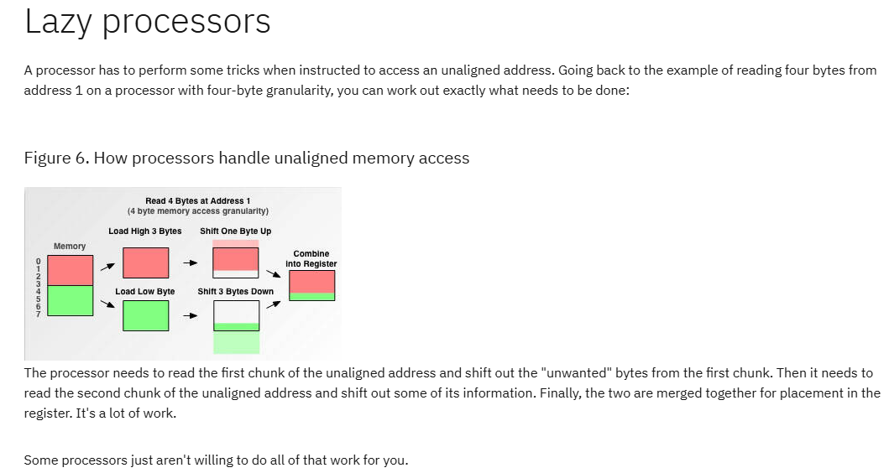

- Stack Grows Downward and Heap Grows Upward generally

- https://gist.github.com/cpq/8598782

- https://www.cs.cornell.edu/courses/cs3410/2024fa/notes/mem.html

  

- The `-Xss` flag sets the stack size for each individual thread in a Java application.
- 

#### Memory Alignment

> https://www.cs.umd.edu/~meesh/cmsc411/website/projects/outer/memory/align.htm#:~:text=If%20you%20were%20to%20access,memory%20a%20misalignment%20would%20occur.
>
> https://developer.ibm.com/articles/pa-dalign/

- CPUs access memory in fixed-size chunks called *words*. Aligned data can be fetched in a single memory access, while unaligned data might require multiple accesses, significantly slowing down operations.
- Different data types have different alignment requirements
- If an address is unaligned, it requires at least two memory accesses