# Computer Resources

### Computation

- CPU

### Memory: 

- Persistent memory
  - Hard driver or SSD
- Volatile memory
  - RAM

##### RAM

- Stack
  - Function Arguments
  - Local Variables
  - Known size at compile time
  - size: Dynamic / Fixed upper limit
  - Cleanup: Automatic  / When function returns

#### Heap

- Values that live beyond a function's lifetime
- Values accessed by multiple threads
- Large values
- Unknown size at compile time
- Size: Dynamic
- Lifetime: Determined by programmer
- Cleanup: Manual

#### Static

- Program's binary
- Static variables
- String literals
- Size: fixed
- Lifetime: Lifetime of program
- Cleanup: automatic When program terminates

## Heap Memory Managing

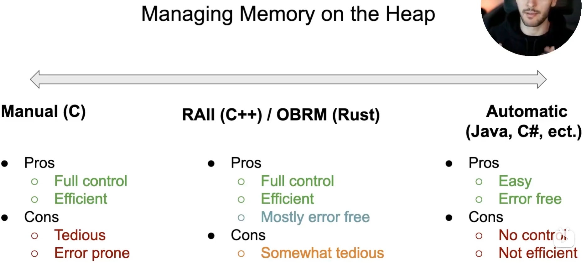

# RAII 

> 利用析构函数 + 对象（Wrapper了原始对象）分配到栈上(不使用new)

### What is a resource

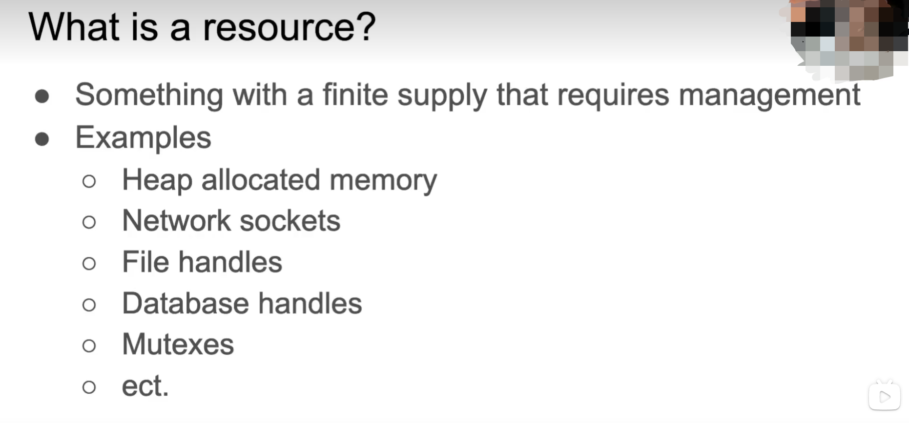

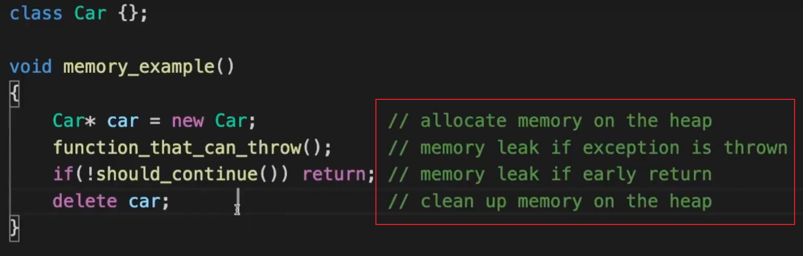

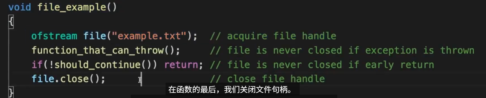

## Solution

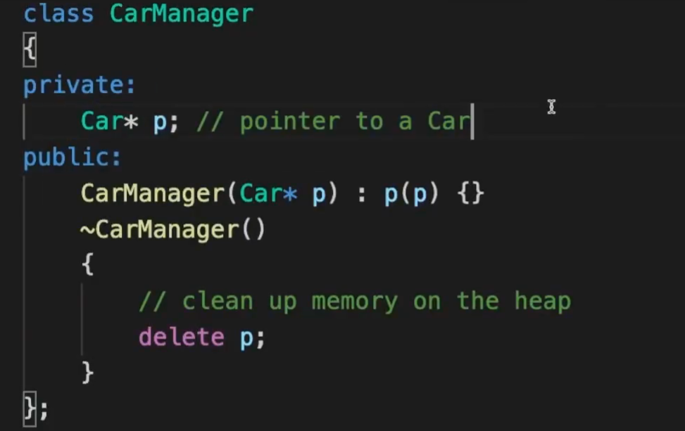

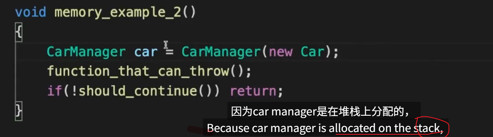

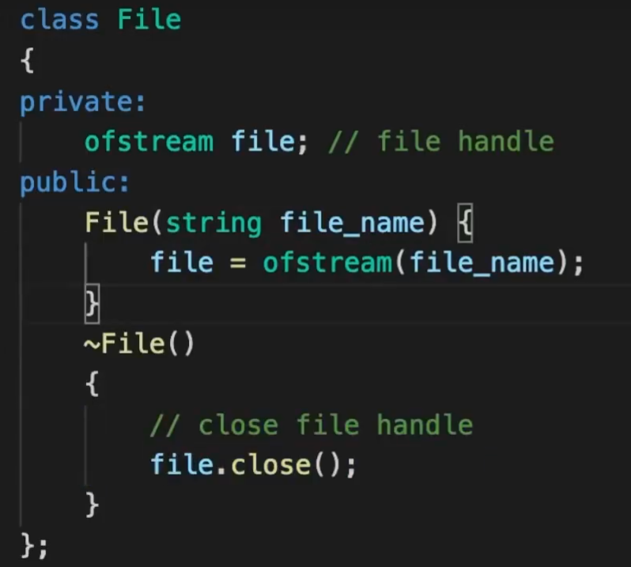

- only one owner

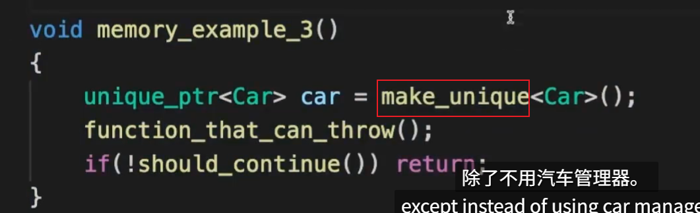

- shared 

  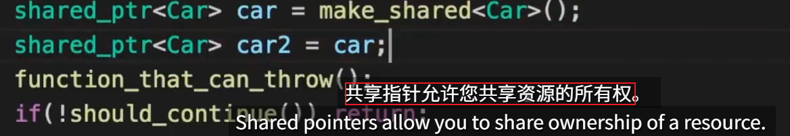

### Ownership Based Resource Management (OBRM)

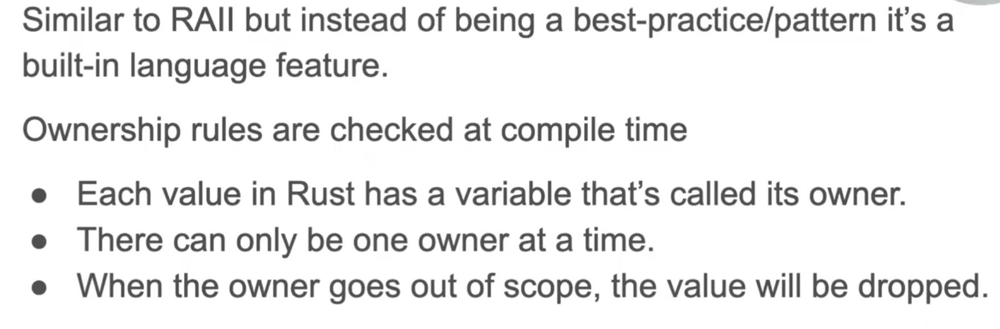

- Rust OBRM VS C++ RAII

  > Rust中ownership不仅用于内存管理，而且用于资源管理,如文件句柄、网络socket等

  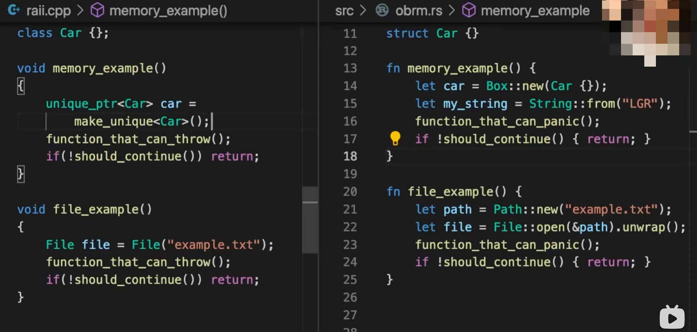

- 所有权转移对比

  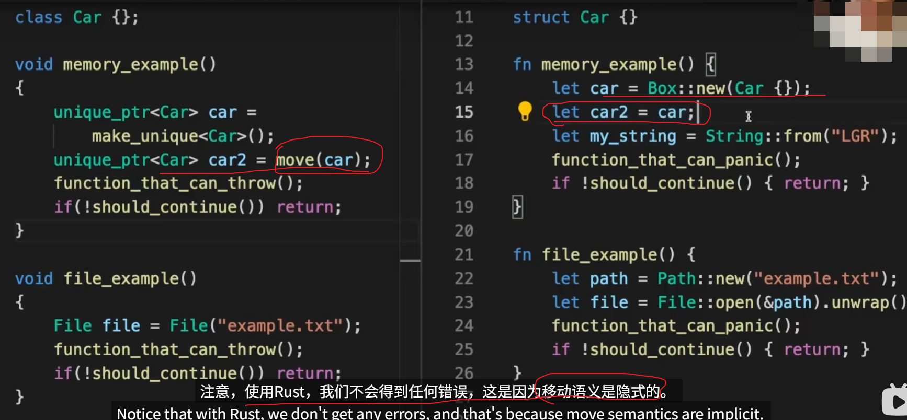

- 共享所有权对比

  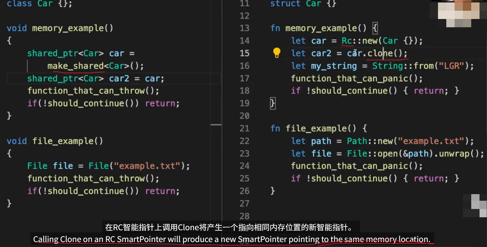

### Cons

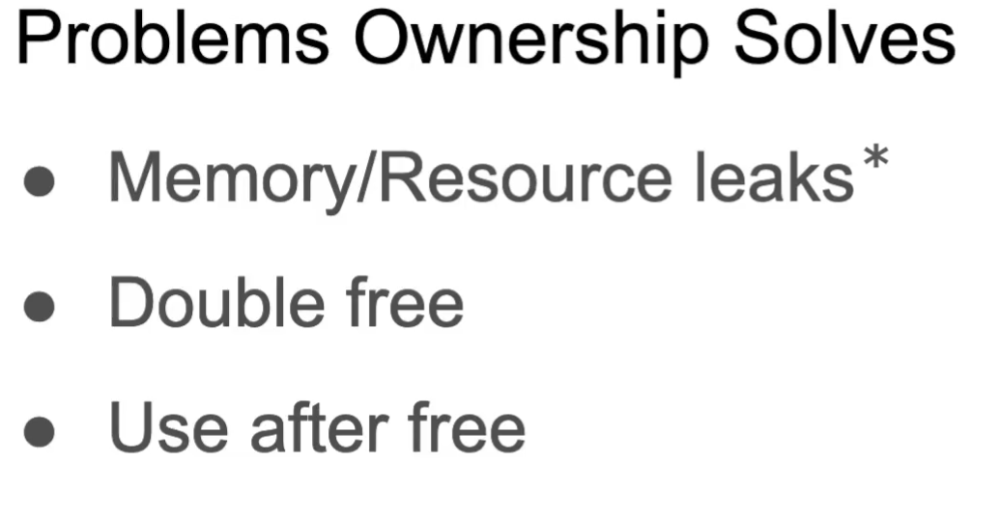

### Tips

- primitives that are entirely stored on stack，即primitive 类型的变量赋值给其他变量 或传递到函数中不会发生move，而是clone
- 赋值发生move: 一个变量赋值给另一个会发生所有权转移
- 所有权转移到函数:  将变量传递到函数中同样会发生所有权转移
- 所有权转移出函数: 函数返回值情况， 如函数返回 String 

### Borrowing

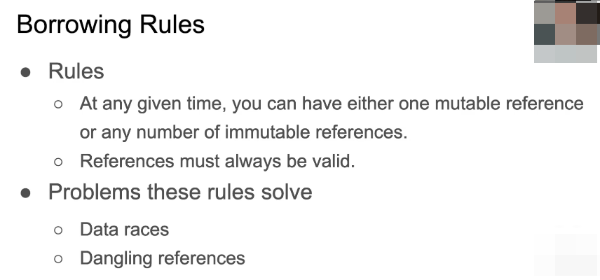