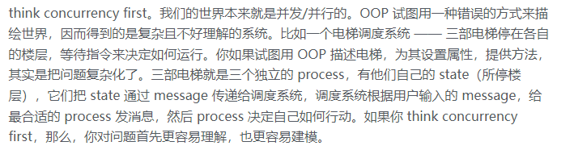
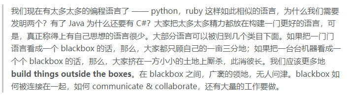
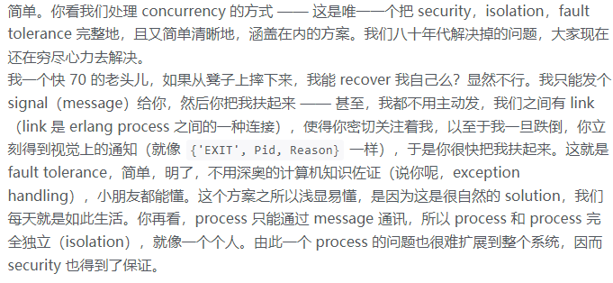
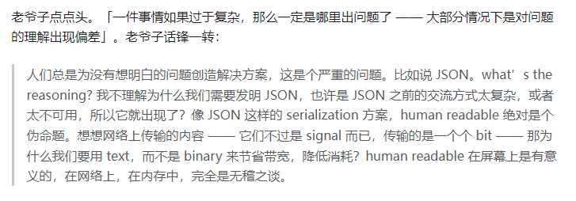
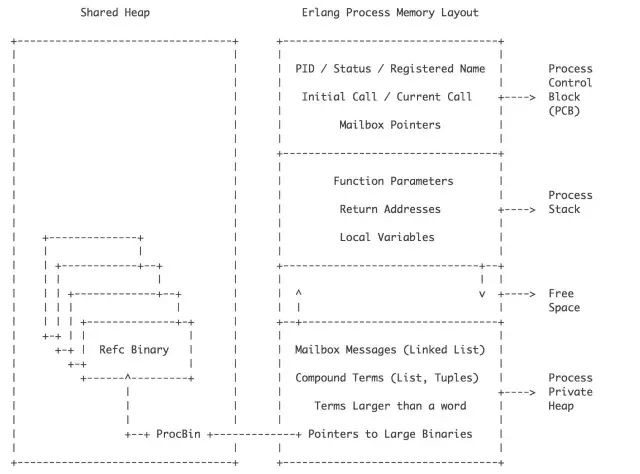
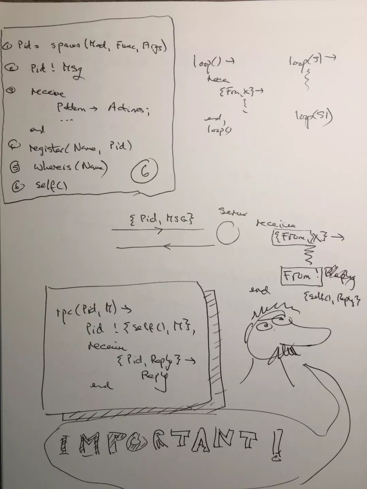

> **people didn’t really distinguish problem & solution. what’s your problem? why are you doing this?**

Erlang 无外乎：spawn，send，receive，register，whereis，self

erlang 的 worldview：

- everything is a process.
- process are strongly isolated.
- process creation and destruction is a lightweight operation.
- message passing is the only way for processes to interact.
- processes have unique names.
- if you know the name of a process you can send it a message.
- processes share no resources.
- error handling is non-local.
- processes do what they are supposed to do or fail.

- spawn：创建一个资源。对于 erlang，这资源是 process；对某个 service，是 service 本身。
- send / receive：给资源发指令和接受指令。对于 erlang，这指令是 message，封装成 erlang term，走的是 IPC/RPC；而对某个 http service，指令是 request，封装成 json / msgpack / protobuf，走的是 http / http2。
- register / whereis：资源怎么注册，怎么发现。对于 erlang，这是 process 在 name register 的注册和发现；对于某个 service，可以是 Consul / DNS。
- self：返回自己的 identity。在 erlang 里，这是 process 找寻自我的方式；在 micro service 的场景下，每个 service 隐含着有自己的 identity。

- https://mp.weixin.qq.com/s/NTy-Af_S0abJOzAKrrRbGQ

### 并发模型

- **CSP**: **Communicating Sequential Processes**
- **Actor Model**
- **STM** :**Software Transactional Memory** (lock-free , rollback/revert) ;  Database , Haskell

### **Design Patterns** in OTP:

1. **GenServer**: GenServer is a generic server design pattern that provides a basic structure for building servers in Erlang OTP. It provides a way to handle incoming requests, manage state, and handle errors.
2. **Supervisor**: Supervisor is a design pattern that provides a way to supervise other processes and ensure that they are running correctly. It provides a way to restart processes that fail and handle errors.
3. **Worker**: Worker is a design pattern that provides a way to perform tasks in the background. It provides a way to handle tasks asynchronously and manage the state of the tasks.
4. **Pool**: Pool is a design pattern that provides a way to manage a pool of resources. It provides a way to allocate and deallocate resources as needed.
5. **Ring**: Ring is a design pattern that provides a way to distribute tasks across multiple nodes in a cluster. It provides a way to handle failures and ensure that tasks are executed correctly.

### Elixir

1. Interactive Elixir shell: iex
2. `=` is match or bind other than assign, everything is immutable
3. functional clauses: single fun can have multiple definition, each called a clause , use pattern match ; **Guard Clause**, **capture functions**
4. **comprehensions** : similar to py do
5. **head and tail patterns**
6. **pattern matching maps**
7. **Enum**
8. **ExUnit** 
9. **Erlang's gen_tcp library**
10. how to **transcode Erlang to Elixir**.
11. OTP GenServer
12. **OTP Supervisor** : **linking processes**
13. **supervision tree** and Fault Recovery 

##### 1. Function Clauses

##### 2. Atom name of the function

> https://elixirforum.com/t/trying-to-understand-the-usage-of-atoms-as-function-names/52502/2
>
> 每个函数有一个atom name, 可使用 apply/3 调用

##### 3. Phoenix

- mix phx.gen.html
- mix phx.gen.context
- mix ecto.migrate
- mix ecto. gen.migration 
- mix phx.gen.json
- mix phx.gen.auth
- mix release
- deploy: **detached mode**  and **disown**