##### Refers 

- https://slides.com/haskellbeginners2022
- https://book.realworldhaskell.org/read/
- https://teaching.well-typed.com/intro/
- https://wiki.haskell.org/index.php?title=Haskell
- https://www.seas.upenn.edu/~cis1940/spring13/lectures.html
- https://learnyouahaskell.github.io/
- https://www.happylearnhaskelltutorial.com/1/how_to_enjoy_learning.html
- https://learn-haskell.blog/
- https://www.haskell.org/irc/

#### GHCup

- ghc: `ghci` REPL

  > compile file:  ghc  xx.hs
  >
  > directly load into ghci:  `ghci  xx.hs` or  in ghci inner  ` :load xx.hs`

- cabal

- stack

- HLS

##### ghci

- `:t`  check type of expressions
- `:i`:  information about a function or type  , like `:i *`
- `:doc` show help info of the specified name `:doc take`
- `:show bindings`
- `:set` ，它可以让我们更改它的一些默认行为, `:set +t` 打印类型
- `:unset +t`
- `:cd change-dir`
- `:m +Data.Ratio` ： load module
- `it`: last correct result in it
- `:{ mutiple-line code  :}`

##### **runghc** 

> run haskell as scripts without compiled it first

###### Terms

- **Ad-Hoc Polymorphism** VS **parametric polymorphism** **Subtype Polymorphism**

- **kind signature**

  > A **kind** is the "type of a type."

- serialization

  > The process of converting data in memory to a flat series of bits for storage is called *serialization*

- deriving

- Selective Import: import partial items `import Data.Char(toUpper)`

- helper function

- **parser combinators**:  Parsec lib

- typeclasses

  > 类型类定义了一组函数，这些函数可以根据它们接收到的数据类型有不同的实现
  >
  > ```haskell
  > -- a is a instance of BasicEq
  > class BasicEq a where
  >     isEqual :: a -> a -> Bool
  > ```
  >
  > 类型约束: `=>` symbol is used in **type signatures** to separate **type class constraints** from the rest of the type. 
  >
  > ```haskell
  > -- type a must be an instance of the Read type class
  > read :: Read a => String -> a
  > ```
  >
  > 

- instances of typeclasses:

  > 类型通过实现该类型类所需的函数来成为特定类型类的实例
  >
  > 内置类型类:  show / read

- 模块结构

  > 源文件必须具有与包含的模块相同的**基名**（后缀之前的部分）
  >
  > 模块名称之后是一个列表，列出了**导出项**（导出列表指示本模块中哪些名称对其他模块可见），用括号括起来
  >
  > where 关键字后是模块body部分
  >
  > **如果我们省略模块声明中的导出（以及包含它们的括号），模块中的每个名称都将被导出**。
  >
  > 我们**可以导出一个类型的名称（即其类型构造函数），但不能导出其值构造函数。这种能力很重要：它让我们能够隐藏类型的细节，使其成为抽象类型**。如果我们看不到一个类型的值构造函数，我们就不能对该类型的值进行模式匹配，也不能构造该类型的新值

- Currying: all function is currying(only has single argument)

  > ```tex
  > `->`: 是右结合
  > Int -> Int -> Int` is equivalent to `Int -> (Int -> Int)
  > ```

- Partial Application: 

  > Because of currying, you can **partially apply** a function by providing only some of its arguments 
  >
  > ```haskell
  > addFive :: Int -> Int  
  > -- add 5 returns a function of type Int -> Int
  > -- addFile function take int arg and return int
  > addFive = add 5 
  > -- call addFile
  > result = addFive 3  
  > ```

- **Qualified Imports**: `import prelude hiding(Not, sort)`

- **MultiWayIf Extension**

- **Case Expressions**

- List Comprehesions

  ```haskell
  squares = [x^2 | x <- [1..10], even x]
  ```

- *structural recursion*  and tail recursive function

  > 尾递归会被自动优化（TCO）

- Partial and total functions

  > Functions that only have return values defined for a subset of valid inputs are called *partial* functions (calling `error` doesn't qualify as returning a value!). We call functions that return valid results over their entire **input domains** *total* functions.
  >
  > It's always a good idea to know whether a function you're using is partial or total. Calling a partial function with an input that it can't handle is probably the single biggest source of straightforward, avoidable bugs in Haskell programs。
  >
  > prelude 模块中定义了很多`unsafe`的function，比如 `head`
  >
  > 一些 Haskell 程序员甚至会给部分函数命名，以 `unsafe` 等前缀开头

- Infix functions 中缀函数 与 前缀函数

  ```tex
  1. 写下函数名，然后是其参数,前缀表示法，因为函数名位于其参数之前.
  2. 如果一个function或constructor接受两个或更多参数，我们可以选择使用中缀形式，即在它的第一个和第二个参数之间放置它。这允许我们将函数用作中缀运算符
  3. 定义或使用中缀表示法应用函数或值构造函数时，我们将它的名称用反引号括起来（有时也称为反引号 
  `a `plus` b = a + b`
  data a `Pair` b = a `Pair` b
                    deriving (Show)
  -- we can use the constructor either prefix or infix
  foo = Pair 1 2
  bar = True `Pair` "quux"
  ```

  

- Local functions

- guard:

  > 个模式可以跟随着零个或多个守卫，每个守卫都是一个布尔类型的表达式。守卫由一个 `|` 符号引入 .
  >
  > **Guards 可以与模式匹配结合使用，进一步增强函数的表达能力。**
  >
  > ```haskell
  > functionName :: Type1 -> Type2 -> ... -> ReturnType
  > functionName arg1 arg2 ...
  >   | condition1 = result1
  >   | condition2 = result2
  >   | otherwise  = defaultResult
  > -- demo   
  > grade :: Int -> String
  > grade score
  >   | score >= 90 = "A"
  >   | score >= 80 = "B"
  >   | score >= 70 = "C"
  >   | score >= 60 = "D"
  >   | otherwise   = "F"
  > 
  > -- guard 与 pattern matching 结合
  > safeHead :: [a] -> Maybe a
  > safeHead [] = Nothing
  > safeHead (x:xs)
  >   | null xs   = Just x  -- 如果剩余列表为空，返回当前元素
  >   | otherwise = safeHead xs  -- 否则继续递归
  > ```

- case expression

  > 函数定义并非唯一可以使用模式匹配的地方。 `case` 构造让我们可以在表达式内进行模式匹配
  >
  > ```haskell
  > fromMaybe defval wrapped =
  >     case wrapped of
  >       Nothing     -> defval
  >       Just value  -> value
  > ```
  >
  > 

- type variable

  ```tex
  data Maybe a = Just a
               | Nothing
  变量 a 不是一个普通变量：它是一个类型变量。它表示 Maybe 类型接受另一个类型作为其参数。这使得我们可以对任何类型的值使用 Maybe
  ```

- Recursive Type

  ```haskell
  data Tree a = Node a (Tree a) (Tree a)
              | Empty
                deriving (Show)
  ```

  

- polymorphism

  ```tex
  a. 列表类型是多态的：列表的元素可以是任何类型
  b. 自定义类型增加多态支持: 使用类型变量， 类似其他语言泛型
  ```
  
-  conditional expressions

-  purity

- lazy evaluation

- reasoning(推理、推导)

- Algebra Data Types (代数类型)

  > 代数数据类型之所以称为“代数”，是因为它们是通过在原始类型上执行某些“代数”运算而生成的。简而言之，具有多个字段的类型是“积类型”，因为它是其所有字段类型的笛卡尔积。而具有多个构造函数的类型是“和类型”，因为它是其构造函数类型的非交集并集，即所有可能类型的可能值的“和”

-  ***type constructor***、**data constructor** ( or value constructor) 及 Record

  ```haskell
  -- BookInfo is called type constructor
  -- Book is value construct sometimes called data constructor(使用它来创建 BookInfo 类型的值)
  -- 值构造函数可以与其类型构造函数具有相同的名称
  -- the Int,String,[String] are components of the type
  -- components sometimes called fields
  data BookInfo = Book Int String [String]
  -- 通过将 Book 视为一个函数，并使用类型为 Int、String 和[String]作为其参数来创建一个新的 BookInfo 类型值
  
  -- 如何访问 field ? pattern match 
  -- 一次性编写各个组件的访问器，避免样板代码 
  -- 其实是类型定义时指定字段名称（相对匿名字段而言），类似struct
  -- 对于我们在类型定义中命名的每个字段，Haskell 都会创建一个同名的访问器函数 
  data Customer = Customer {
        customerID      :: CustomerID
      , customerName    :: String
      , customerAddress :: Address
      } deriving (Show)
  -- 等价如下
  data Customer = Customer Int String [String]
                  deriving (Show)
  
  customerID :: Customer -> Int
  customerID (Customer id _ _) = id
  
  customerName :: Customer -> String
  customerName (Customer _ name _) = name
  
  customerAddress :: Customer -> [String]
  customerAddress (Customer _ _ address) = address
  
  -- 使用 Record 语法创建值: field顺序可以任意
  -- 标准库 System.Time 模块很好地利用了记录语法
  customer2 = Customer {
                customerID = 271828
              , customerAddress = ["1048576 DiskDrive"]
              , customerName = "Jane Q. Citizen"
              }
  }
  
  ```

  > 代数数据类型可拥有多个值构造函数: `data Bool = False | True`
  >
  > **Haskell 支持代数和抽象数据类型**(一般使用ADT表示)
  >
  > **何时使用代数数据类型(自定义数据类型) ？何时使用元组？**

  ```haskell
  -- file: ch03/BookStore.hs
  type CardHolder = String
  type CardNumber = String
  type Address = [String]
  
  data BillingInfo = CreditCard CardNumber CardHolder Address
                   | CashOnDelivery
                   | Invoice CustomerID
                     deriving (Show)
                     
  ```

- Pattern Matching

  ```tex
  使用value constructor 创建 value, 使用 pattern matching进行逆向操作——解构(deconstruct)
  模式匹配充当构建的逆过程，有时被称为解构
  ```

  >  Haskell lets us define a function as a *series of equations* (等式或方程)
  >
  > ```haskell
  > -- function apply时若匹配成功，则使用该等式的右侧作为函数应用的结果
  > -- 匹配从上到下进行，并在第一次成功匹配时停止
  > sumList (x:xs) = x + sumList xs
  > sumList []     = 0
  > ```
  >
  > - **使用 value constructor 在代数数据类型上进行模式匹配**
  >
  >   ```haskell
  >   -- 类似 getter 类方法
  >   bookID      (Book id title authors) = id
  >   bookTitle   (Book id title authors) = title
  >   bookAuthors (Book id title authors) = authors
  >   
  >   bookID (Book 3 "Probability Theory" ["E.T.H. Jaynes"]) will get  3
  >   ```
  >
  >   ```tex
  >   模式 `(3:xs)` 首先检查一个值是否为非空列表，通过匹配 (:) 构造函数。它还确保列表的头部具有确切的值 3 。如果这两个条件都成立，则将列表的尾部绑定到变量 xs 
  >   ```
  >
  >   - 通配符:  `_` 不关心模式的一部分中有什么

- 

##### Conceptions

- variable bind: ` x = 1 + 2`  give a name to the expression

  > 将变量绑定到表达式后，可以用它来替换该表达式，因为它不会改变。在命令式语言中，这种可替代性的概念不成立

- Equational reasoning model (use substitution and equational reasoning 代入（替换）与等式推理)

  > demo:  https://gilmi.me/blog/post/2020/10/01/substitution-and-equational-reasoning
  >
  > 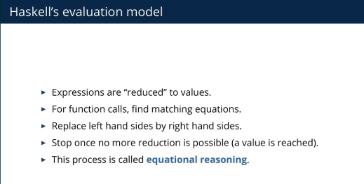
  >
  > 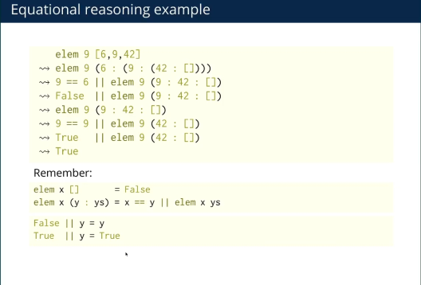

- **Pattern Matching**: Haskell uses pattern matching to define functions

  > lastButOne :: [a] -> Maybe a
  > lastButOne []       = Nothing  -- 空列表
  > lastButOne [_]      = Nothing  -- 只有一个元素
  > lastButOne [x, _]   = Just x   -- 有两个元素
  > lastButOne (_:xs)   = lastButOne xs  -- 递归处理
  >
  > `lastButOne (_:xs) = lastButOne xs` 中的 `()` 并不是元组，而是**模式匹配**的语法
  >
  > - `:` 是列表的构造器（cons operator），用于将元素与列表连接。
  > - `_` 是一个通配符，表示我们不关心这个元素的具体值。
  > - `xs` 是列表的剩余部分（即去掉第一个元素后的子列表）
  >
  > `(x:y:z:_) = [1,2,3,4,5,6]` 匹配前 3 个元素

- Lazy Evaluation

- pure function

  > - **Deterministic** ：always produces the same output for the same input. 
  >
  >   > The function's behavior depends **only** on its input arguments.It does not depend on any external state, such as global variables, system time, or random number generators
  >
  > - **NO Side Effects**
  >
  >   > - It does not modify any external state (e.g., global variables, files, databases).
  >   > - It does not interact with the outside world (e.g., printing to the console, reading from a file)
  >
  > - **Referential Transparency**
  >
  >   > 替换后会丢失原来副作用
  >
  >   > - You can replace a function call with its result without changing the behavior of the program.
  >   > - This property makes pure functions easier to reason about, test, and optimize.

- referential transparency 

- side effects

  > **side effect** is anything that affects or is affected by the "outside world" beyond the pure computation of a function
  >
  > In **pure functional programming** (like Haskell), functions are not allowed to have side effects. Instead, side effects are **encapsulated** in types like `IO` or `State`, and the language runtime ensures that these effects are performed in a controlled way。
  >
  > 不符合 pure function 的都是副作用
  >
  > In Haskell, side effects are encapsulated in monads to:
  >
  > 1. **Preserve purity**: Pure functions are easier to reason about, test, and optimize.
  > 2. **Control evaluation**: Monads like `IO` ensure that side effects are performed in a predictable order.
  > 3. **Separate concerns**: By isolating side effects, you can keep the majority of your code pure and functional.

- I/O actions

  > Haskell's purity is maintained by encapsulating side effects in the `IO` type.

- monad (monadic actions)

  > 软件的大部分风险在于与外界的对话，无论是处理错误或丢失的数据，还是处理恶意攻击。因为 Haskell 的类型系统准确地告诉我们代码的哪些部分有副作用

  > `:doc Monad`  to see detail definition 
  >
  > - monads can be used to encapsulate side effects
  > - not all monads are about side effects. Many monads are used to model **computational contexts** that have nothing to do with side effects.  **Monads are not just for side effects**

  > - a concept from a branch of mathematics known as **category theory**
  >
  > - from perspective of programmer  to think the monad as  an **abstract datatype** of **actions**
  >
  > - haskell use `do` expresions to writting **monadic expressions**
  >
  > - operations:
  >
  >   > **`>>=` (bind)**: mean bind , Chains two monadic actions, passing the result of the first action to the second.
  >   >
  >   > **`>>` (then)**: Sequences two monadic actions, discarding the result of the first.
  >   
  > - **return** 
  >
  >   ```tex
  >   We can inject a value into a monad using return. We can extract a value from a monad using (>>=) but the function on the right, which can see an unwrapped value, has to wrap its own result back up
  >   ```
  >
  >   
  >
  > Monad 提供了一种统一的方式来处理：
  >
  > - 副作用（如 IO）。
  > - 可能失败的计算（如 Maybe）。
  > - 非确定性计算（如 List）。
  > - 状态传递（如 State Monad）。
  >
  > 通过 Monad，我们可以将复杂的计算分解为简单的步骤，同时保持代码的纯函数式风格。

- **`Applicative`** 

- ## Semigroup

- error report:  `标准函数 `error :: String -> a``

  > 一般使用 Maybe 类型来表示错误的可能性： Nothing , Just 等

- **Associativity** 

- Monoid

- Kind `:kind`

- type constructor

- Functor

  > A `Functor` represents a **context** or **container** that you can apply a function to. The function is applied to the value(s) inside the context, and the result is wrapped back into the same context
  >
  > 
  >
  > Functor law 1: **Identity** 
  >
  > ​    fmap id≡idfmap id≡id
  >
  > Functor law 2: **Composition**
  >
  > fmap (f . g)≡fmap f . fmap gfmap (*f* . *g*)≡fmap *f* . fmap *g*

- id: The `id` function simply returns its input unchanged

- Folds

  > foldr (fold right) 、foldl  (fold left)

  > 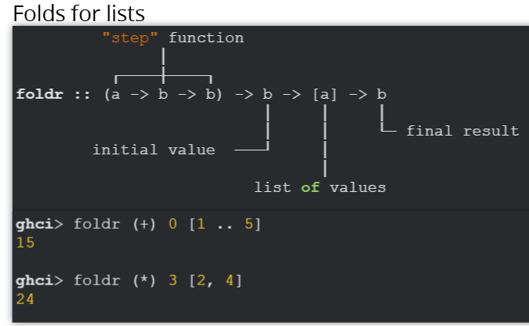
  >
  > 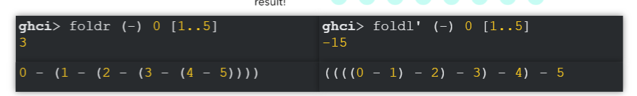

- 

##### Syntax and Features

###### 1. Basic

- **Type System**

  > why?
  >
  > At the lowest level, a computer is concerned with bytes, with barely any additional structure. What a type system gives us is ***abstraction***. A type adds meaning to plain bytes: it lets us say “these bytes are text”, “those bytes are an airline reservation”, and so on. Usually, a type system goes beyond this to prevent us from accidentally mixing types up: for example, a type system usually won't let us treat a hotel reservation as a car rental receipt
  >
  > **The benefit of introducing abstraction is that it lets us forget or ignore low-level details**.
  >
  > 编程语言的类型系统深深影响了我们用该语言思考和编写代码的方式.
  >
  > 在学术计算机科学中，“强”和“弱”的含义具有狭义的技术含义：强度是指类型系统的*宽容程度*。较弱的类型系统比较强的类型系统将更多表达式视为有效.
  >
  > 拥有*静态*类型系统意味着编译器在编译时、执行任何代码之前就知道每个值和表达式的类型.
  >
  > 要理解静态类型的价值，一个有用的类比是将其视为将碎片放入拼图游戏中。在 Haskell 中，如果一块的形状不正确，它就根本不适合。在动态类型语言中，所有块都是 1x1 正方形并且始终适合，因此您必须不断检查生成的图片并检查（通过测试）它是否正确

- 中缀与前缀转换 ` 1 + 2`   与 `(+) 1  2` 效果相同

- **`=` for Pure Computations**

- `<-`: extract value from Monadic actions and must in `do` block

- **do-notation** — syntax sugar for **>>=,** **>>** and **let-in**

  > 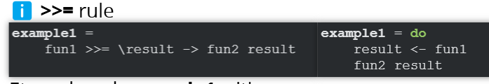
  >
  > 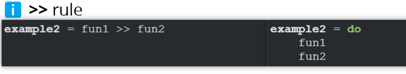
  >
  > 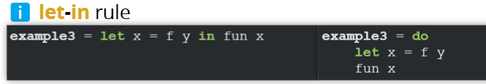

- `>>=` vs `>>`

  > `>>=` (bind):  
  >
  > 
  >
  > 
  >
  > `>>` (then):
  >
  > 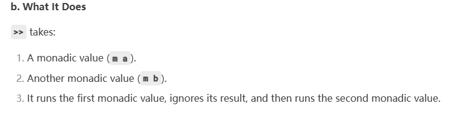

- function : 

  > **define** :    `functionName :: Type1 -> Type2 -> ... -> TypeN -> ReturnType `  
  >
  > - `->`: The arrow symbol separates argument types from the return type
  >
  > **call function**:  `functionName arg1  arg2  arg3  ... argN`
  >
  > 
  >
  > `add :: Int -> Int -> Int `
  > `add x y = x + y` 
  >
  > **functionName** :: **type** **functionName** arg1 ... argN = result
  >
  > 
  >
  > - **Recursive function definition syntax**
  >
  >   > base case + recursive case 
  >   >
  >   > ```haskell
  >   > factorial :: Integer -> Integer
  >   > factorial 0 = 1  -- Base case
  >   > factorial n = n * factorial (n - 1)  -- Recursive case
  >   > ```
  >
  > - **Regular function definition syntax**
  >
  > **styles of definition** :
  >
  > - simple 
  > - pattern matching (recursive)
  > - guards: similar to if-else-then
  > - where: define local variable or define helper function in func body

- function application is left associative(左结合)

  > expression `a b c d` is equivalent to `(((a b) c) d)`
  >
  > 如果我们想使用一个表达式作为另一个表达式的参数，我们必须使用显式括号来告诉解析器： `head (drop 4 "azerty")`

- `->`: right associated(右结合)

  > 对多参数函数如 take 类型:  `take :: Int -> [a] -> [a]`
  >
  > 使用括号等效表达是 `take :: Int -> ([a] -> [a])`
  >
  > 解释为： 一个带有一个参数的函数， Int ，并返回另一个函数。该另一个函数也接受一个参数（一个列表），并返回一个与其结果类型相同的列表。
  >
  > **可以将最后一个`->`之后的类型视为函数的(最终)返回类型，将前面的类型视为函数参数的类型**

- (): 用于分组, 一般用于优先级处理

- Types: expressions has types ` expr :: type `  ` use :t or :type to show an expression's type in ghci`

- cons: mean constructor , use ` :`  used to add elements to the begin of list

- type signature:  like  `21 :: Num p => p`   or like  `True :: Bool`

  > **`::`   :**This is the type declaration operator. It reads as "has the type of"
  >
  > `Num p => p` :  is type constraint
  >
  > `Num` :  is a type class
  >
  > `p` is a type variable. It represents any type that is an instance of the `Num` class

- type class: Type classes allow you to define a set of operations that can be performed on different types

- **Numeric constants are polymorphic in Haskell by default** 

  > a single numeric constant can represent values of different numeric types
  >
  > 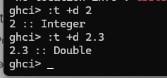

- **Automatically Curring**: each function only accept one parameter and return another function

  > **Function Currying:** Haskell functions are inherently curried. This means a function that takes multiple arguments can be seen as a series of single-argument functions
  >
  > 
  >
  > **`add :: Int -> Int -> Int `**
  >
  > This reads as: `add` is a function that takes an `Int` and returns a function that takes another `Int` and returns an `Int`
  >
  > 
  >
  > **Partially applied funciton**
  >
  > `add` can be partially applied. You can give it one argument and get back a new function that expects the second argument.
  >
  > 
  >
  > **Multiple Arrows?**
  >
  > - **Flexibility:** This currying behavior gives you flexibility in how you apply functions. You can apply all arguments at once, or apply them one by one.
  > - **Partial Application:** This is a powerful concept in functional programming. It allows you to create new functions by partially applying existing functions
  >
  > 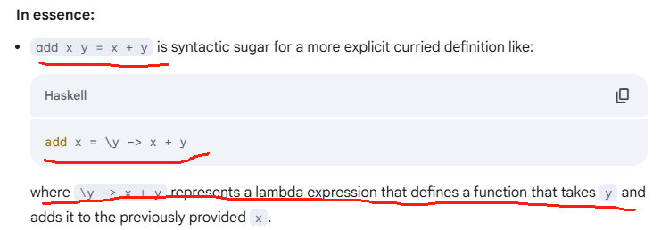

- overloading:  same function(behaviour) can be apply to diffrent types

- **if-then-else and guard**

  > functionName argument
  >
  > ​	| condition 1 = expr1
  >
  > ​	| condition 2 = expr2
  >
  > ​	| otherwise = expr3

- local bindings

  > let..in
  >
  > where

- pattern matching 

  > case of
  >
  > use `:`  do :    (x : xs) = [1,2,3,4] :   x is `1` and xs is `[2,3,4]`

- Immutable

- Laziness

- STM: Software Transactional Memory

###### 2. List

> 函数式编程的面包与黄油 （ bread and butter of functional programming）
>
> Data.List模块中常用函数:
>
> `length`：列表元素个数 （会遍历整个list）； 
>
> `null` : 列表是否为空
>
> `head` / `tail` (返回除第一个元素之外剩余所有元素)/last/init(last的逆操作)
>
> 除了 tail外，其他function表现不佳
>
> `(++)`: append  , `reverse` , `take`, `splitAt`
>
> `takeWhile` , `dropWhile`  ,  `span` ,`break`
>
> `elem` , `notElem` , `filter` , isPrefixOf` 、 `isInfixOf` 和 `isSuffixOf
>
> `zip` , `zipWith`
>
> `and` 与 `or` 主要针对bool类型的list
>
> `all` and `any` 需与一个谓词函数结合使用:  `all odd [1,3,5]`
>
> `concat`: take a list of list as input,return a single list (similar to flat in java stream)

> ranges:  [1..10] , ['a'..'z']
>
> `[10 .. 1] ` will get `[]`   but `[10,9..1]` will `[10,9,8,7,6,5,4,3,2,1]`

###### 3. Lazy evaluation

> 惰性求值某些情况下导致意外的结果: 
>
> `take 3 [0 .. ] ` get `[1,2,3]`  other than error 
>
> `[5, head [],7] !! 2` get `7`  other than throw an error

###### 4. String 

> **String** in Haskell is a list of characters
>
> funcs:   words/unwords
>
> `lines` , `unlines`  
>
> `words` , `unwords`

###### 5. immutable

> values are never changed !  **how do you change if you can't ==> Recursion  other than loops!**      No More loops!

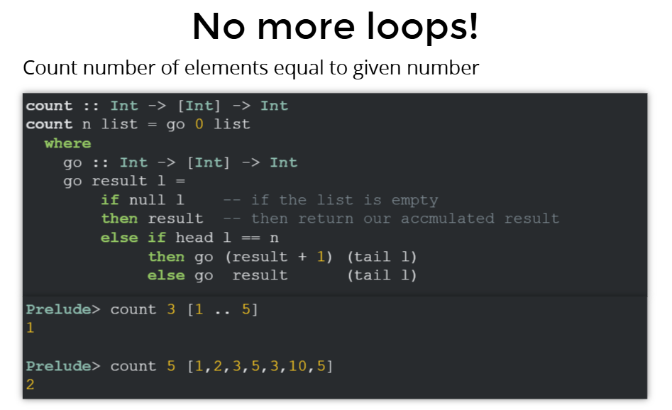

###### 6. High order function

- pass function as argument of another function
- λ functions  `\var1 var2 ... varN -> expression`
- Partial application
- std HOFs:  map , filter, any, concatMap
- store functions inside lists

###### 7. tuples

- as function returns
- do pattern matching

###### 8. ADT(Alebraic Data Type)

- `type`: define alias for exist type
- `newtype`
- data constructor and pattern matching

> a type formed by combing other types using either ***product*** or ***sum*** types

- use data  keyword define ADT

  > data type_name = ConstructorName  fieldType1  fieldType2 ...
  >
  >   `data User = MkUser String  Int Bool`
  >
  > `getUserName :: User -> String`
  >
  > `getUserName (MkUser name _ _) = name`

- data Records

  > Records in Haskell are a way to define **named fields** for data types
  >
  > 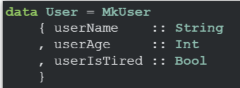

- sum type

  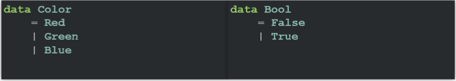

  **similar Rust Result**

  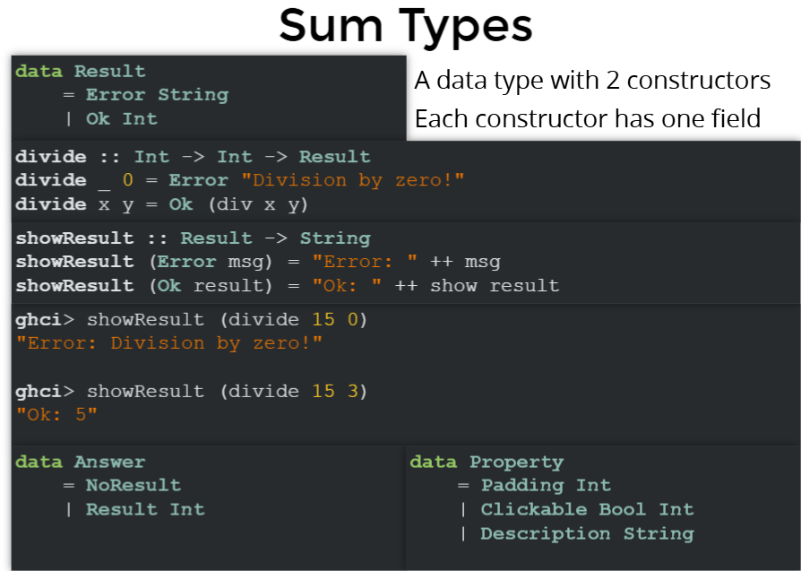

  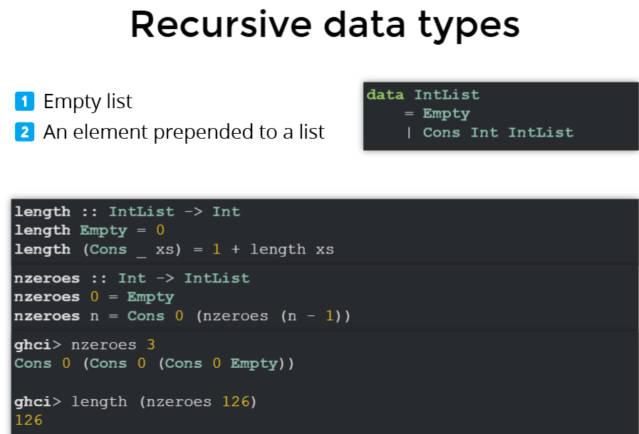

###### 9. Polymorphism

- call the **list type** *polymorphic*
- **type variable** : 类型变量是一个占位符，最终我们将用它替换真实类型

- **parametric Polymorphism**

  > Specific types start with an upper letter: String, Int, Bool, ...
  >
  > Type variables start with a lower letter: a, b, c, f, m....
  >
  > Haskell 中的参数化类型类似于 Java 泛型中的类型变量

###### 10. Function Composition

> (length . show) **True**:  show be called first then length 
>
> `map (length . words) ["Hi all", "bi dup boo", "x"]`  get  `[2,3,1]`

###### 11. typeclasses

> **Typeclasses take power, not grant**  ===> constraints , similar java's interface
>
> **Typeclasses Are Constraints**: When you define a function that works with a typeclass, you are saying, "This function can only work with types that satisfy these constraints." 
>
> - **class** : define shared behavior (like interfaces in other languages) across multiple types
> - **instance**: `instance` keyword is used to **implement a typeclass** for a specific type.
> - **data**: define **new types** in Haskell. It allows you to create custom data types by specifying their constructors and fields

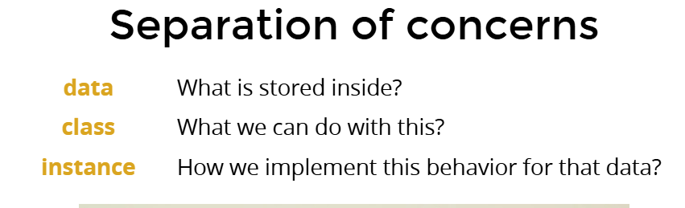

- newtype: newtypes help implement different behaviour for the same type
- type inference
- deriving: auto generate instances