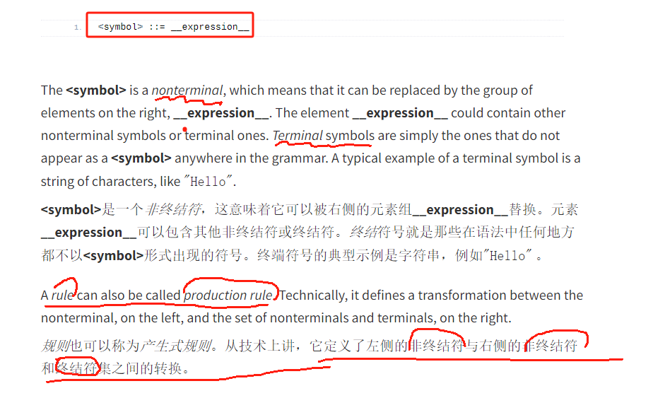

##### Parser Conception

> A complete parser is usually composed of two parts: a *lexer*, also known as *scanner* or *tokenizer*, and the proper parser. The parser needs the lexer because it does not work directly on the text, but on the output produced by the lexer.Not all parsers adopt this two-steps schema: some parsers do not depend on a separate lexer and they combine the two steps. They are called *scannerless parsers*.
>
> 
>
> Scannerless parsers operate differently because they process directly the original text, instead of processing a list of tokens produced by a lexer. That is to say, a scannerless parser works as a lexer and a parser combined.
>
> There are two important parts in this definition: a grammar describes a language, but this description pertains **only to the syntax** of the language and **not the semantics**
>
> - terminal symbol (原子的)
>
> - *nonterminal*
>
>   
>
> **Parse Tree:** A tree-like structure that represents the syntactic structure of a parsed program. Each node in the tree corresponds to a grammar rule or a terminal symbol. parse tree could also be called **Concrete Syntax Tree (CST)**
>
> **Abstract Syntax Tree (AST):** A simplified version of a parse tree that focuses on the semantic meaning of the code, abstracting away syntactic details like parentheses and keywords.
>
> **Parser 只关注 句法正确性而非语义正确性**
>
> #### Left-recursive Rules 左递归规则
>
> ```tex
> addition       : expression '+' expression
> multiplication : expression '*' expression
> // an expression could be an addition or a multiplication or a number
> expression     : multiplication | addition | [0-9]+
> ```

##### 状态机

> DFA 在词法分析器的情况下是状态机，因此这种区别通常没有实际意义。这是因为状态机实现起来相对简单（即有现成的库），所以大多数时候DFA都是用状态机来实现的。这就是为什么我们要简要讨论 DFA 以及它们经常用于词法分析器的原因.
>
> DFA 是一个（有限）状态机，我们假设您熟悉这个概念。基本上，状态机有许多可能的状态以及每个状态的转换函数。这些转换函数控制机器如何响应事件从一种状态转移到另一种状态。当用于词法分析时，机器一次输入一个输入字符，直到它达到可接受的状态（即，它可以构建一个token）

##### PEG:

> **Parsing Expression Grammar** (PEG) is a format presented by [Brian Ford in a 2004 paper](https://pdos.csail.mit.edu/papers/parsing:popl04.pdf). Technically it derives from an old formal grammar called **Top-Down Parsing Language** (TDPL). However a simple way to describe is: EBNF in the real world

ANTLR4 grammar
https://github.com/antlr/grammars-v4

https://tomassetti.me/antlr-mega-tutorial/

- Janino
- javaparser: https://javaparser.org/

https://tomassetti.me/a-tutorial-on-how-to-write-a-compiler-using-llvm/

https://tomassetti.me/guide-parsing-algorithms-terminology/

##### Query Engine

- apache Calcite
- datafusion (rust)

##### Parser

> Parser Combinator: 构建一个递归下降的解析器
>
> 解析器组合子本质上是一种高阶对象，其接收多个其他解析器作为参数，构造出一个新的解析器。通过组合的方式由简到繁、由小到大的描绘出目标语言的语法规则。解析器组合子描述的分析器易于构造、结构良好、具有可读性且易于维护，很适用于规模不大且需要快速开发的场景。解析器组合子一般采用自顶向下的递归下降分析法，并在分析的过程中配合 GLL 等算法的思想，可以较好的处理左递归文法及二义文法

> BNF: 上下文无关 不管是为特定领域而发明的各类 DSL，还是图灵完备的 GPL 语言，他们基本都符合 BNF（**巴科斯范式**）。
>
> BNF 是一种 **上下文无关文法**，举个例子就是，人类的语言就是一种 上下文**有关**文法
>
> 计算机语言多数是符合 BNF 的上下文无关语言，从表达能力上分为 DSL 和 GPL 两类；而人类语言属于上下文有关语言，其实正是由于这一点，才给在 NLP（自然语言理解）领域带来了不少困难。

> 首先是前面提到的BNF终结符和非终结符，重复一下上面解释 BNF 时举的抽象表达式：`<符号> ::= <使用符号的表达式>`。可以这样来理解：
>
> - 由词法解析器生成的符号，也叫 token，是终结符。终结符是最小表义单位，无法继续进行拆解和解析
> - 规则左侧定义的符号，是非终结符。非终结符需要进行语法解析，最终由终结符构成其表示形式
>
> 其次是 NFA 和 DFA，FA 表示 Finite Automata（有穷状态机），即根据不同的输入来转换内部状态，其内部状态是有限个数的。而 NFA 和 DFA 分别代表 有穷不确定状态机 和 有穷确定状态机。运用子集构造法可以将 NFA 转换为 DFA，让构造得到的 DFA 的每个状态对应于 NFA 的一个状态的集合。
>
> 词法分析器（lexer）生成终结符，而语法分析器（parser）则利用自顶向下或自底向上的方法，利用文法中定义的终结符和非终结符，将输入信息转换为 AST（抽象语法树）。也就是我们在此次需求中需要获得的东西
>
> - FSA , CFG（Context Free Grammar）,PDA

- 

- ANTLR

- Javacc

- javaparser

- rust Pest , Nom

  

