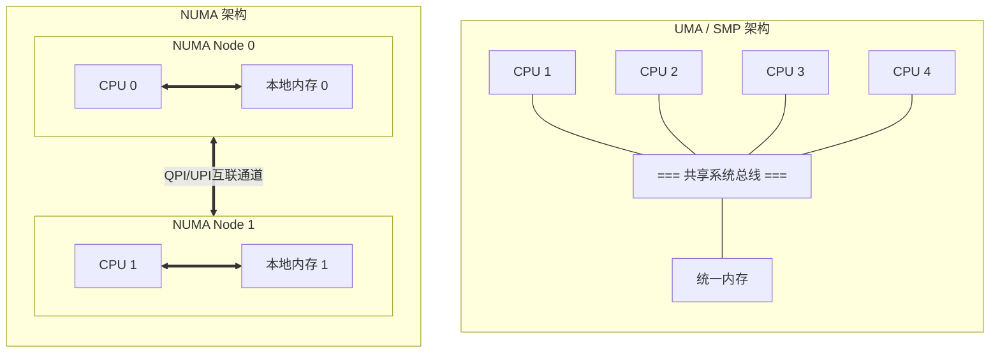

# NUMA (Non-Uniform Memory Access) 架构详解

**NUMA (非一致性内存访问)** 是一种为多处理器系统设计的内存架构，其核心特点是：**处理器访问不同内存区域的速度是不同的**。

---

## 1. 为什么需要 NUMA？

在 NUMA 出现之前，主流是 **UMA (Uniform Memory Access)** 架构（也叫 SMP 对称多处理）。

*   **UMA (SMP) 模式**：所有 CPU 通过**同一条总线**访问同一块大内存。
    *   *瓶颈*：随着 CPU 核心数增加，这条共享总线变得非常拥堵，成为性能瓶颈。
*   **NUMA 模式**：将内存切分，分配给不同的 CPU。每个 CPU 有自己的"本地内存"。
    *   *优势*：扩展性好，CPU 核心数可以很多。

## 2. 架构对比图解



## 3. 核心概念

### 3.1 NUMA Node (节点)
一个物理 CPU 插槽（Socket）及其直连的内存条组成一个 **NUMA Node**。
*   例如：双路服务器（2个物理 CPU）通常有 2 个 NUMA 节点。

### 3.2 访问路径与延迟
*   **本地访问 (Local Access)**：CPU 访问自己节点内的内存。
    *   *速度*：**极快**，延迟低，带宽大。
*   **远程访问 (Remote Access)**：CPU 访问其他节点的内存（通过 QPI/UPI 总线）。
    *   *速度*：**较慢**，延迟高（通常是本地访问的 1.5 - 2 倍），且消耗互联带宽。

## 4. 性能影响与优化

### "吵闹邻居"的另一面
在 NUMA 架构下，如果你的程序在 Node 0 的 CPU 上运行，但大量数据分配在 Node 1 的内存中，性能会显著下降。

### 优化策略
1.  **CPU 亲和性 (Affinity)**：将进程绑定到特定的 NUMA 节点，防止操作系统将其调度到其他节点的 CPU 上。
2.  **内存分配策略**：
    *   `localalloc` (默认)：在当前 CPU 所在的节点分配内存。
    *   `interleave` (交织)：轮询在所有节点分配，适合大内存且无法确定访问模式的应用（如 Oracle 数据库），以利用所有内存带宽。
3.  **First-touch 策略**：Linux 默认策略。内存页在**第一次被写入**时，才真正分配物理内存，且分配在发起写入的 CPU 所在节点。

## 5. 常用命令

```bash
# 查看 NUMA 拓扑
numactl --hardware

# 查看进程的 NUMA 内存分布
numastat -p <PID>

# 绑定进程到 Node 0 运行
numactl --cpunodebind=0 --membind=0 ./my_program
```
