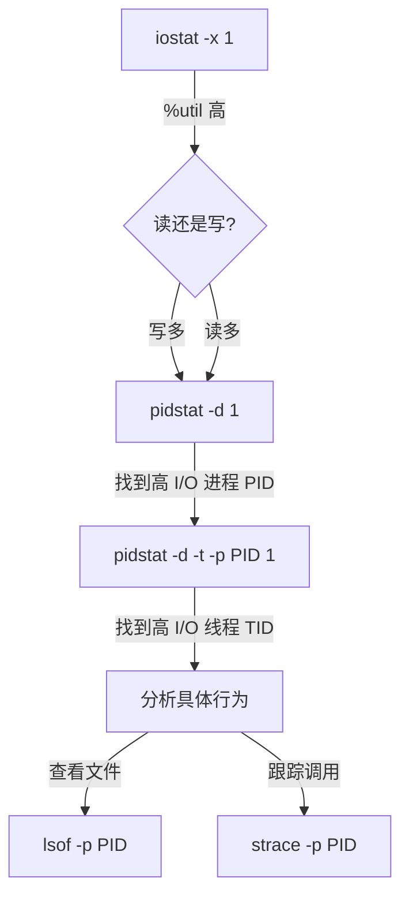

# 实战指南：使用 pidstat 定位 iostat 高 %util 问题

当 `iostat` 显示磁盘 `%util`（利用率）很高（接近 100%）时，说明磁盘 I/O 存在瓶颈。
本指南将带你一步步使用 `pidstat` 揪出"元凶"进程。

## 1. 确认问题：iostat

首先，确认磁盘确实繁忙。

```bash
# 每秒刷新一次，显示扩展统计信息
iostat -x 1

# 关键输出示例：
# Device  r/s   w/s   rkB/s   wkB/s   await  %util
# sda     10.0  500.0 40.0    20000.0 5.0    98.5   <-- 报警！
```
*   **%util** > 80%：表示磁盘非常繁忙。
*   **await**：平均等待时间，如果很高（如 > 10ms），说明请求在排队。

## 2. 定位进程：pidstat

`iostat` 只能告诉你磁盘忙，但不能告诉你**谁**在忙。这时需要 `pidstat`。

### 2.1 查看所有进程的 I/O

```bash
# -d: 显示 I/O 统计
# 1: 每秒采样一次
pidstat -d 1
```

**输出解读：**
```text
PID   kB_rd/s   kB_wr/s   kB_ccwr/s  Command
1001  0.00      15000.00  0.00       mysql      <-- 嫌疑人 A
2048  5000.00   0.00      0.00       backup.sh  <-- 嫌疑人 B
```
*   **kB_rd/s**：每秒读取 KB 数。
*   **kB_wr/s**：每秒写入 KB 数。
*   **Command**：进程名。

### 2.2 揪出"元凶"

观察 `kB_rd/s` 和 `kB_wr/s` 最高的进程，通常就是导致 `%util` 高的原因。
*   如果 `iostat` 显示主要是写（w/s 高），关注 `kB_wr/s` 高的进程。
*   如果 `iostat` 显示主要是读（r/s 高），关注 `kB_rd/s` 高的进程。

## 3. 深入分析：定位到线程

如果是多线程程序（如 Java, MySQL），光知道进程 PID 还不够，最好知道是哪个线程在搞鬼。

```bash
# -t: 显示线程级统计
# -p <PID>: 指定进程 ID
pidstat -d -t -p 1001 1
```

**输出示例：**
```text
TGID   TID   kB_rd/s   kB_wr/s   Command
1001   1001  0.00      0.00      java      (主线程)
1001   1023  0.00      12000.00  java      (Log-Thread) <-- 找到你了！
1001   1024  0.00      10.00     java      (Worker)
```
*   **TID**：线程 ID。
*   通过 TID，你可以结合 `jstack` (对于 Java) 找到具体的代码堆栈。

## 4. 终极定位：在读写什么文件？

`pidstat` 告诉你谁在读写，但没告诉你**读写哪个文件**。
结合 `lsof` 和 `strace` 完成最后一步。

### 4.1 查看打开的文件 (lsof)
```bash
# 查看 PID 1001 打开的所有文件
lsof -p 1001
```

### 4.2 实时跟踪文件操作 (strace)
```bash
# 跟踪 write 系统调用，统计耗时
# -T: 显示系统调用耗时
# -e trace=write: 只跟踪写操作
strace -T -e trace=write -p 1001

# 输出示例：
# write(3, "data...", 4096) = 4096 <0.000050>
# write(3, "data...", 4096) = 4096 <0.000045>
```
*   文件描述符 `3` 是哪个文件？看 `lsof -p 1001` 的输出中 `FD` 列为 `3` 的行。

## 总结流程图


