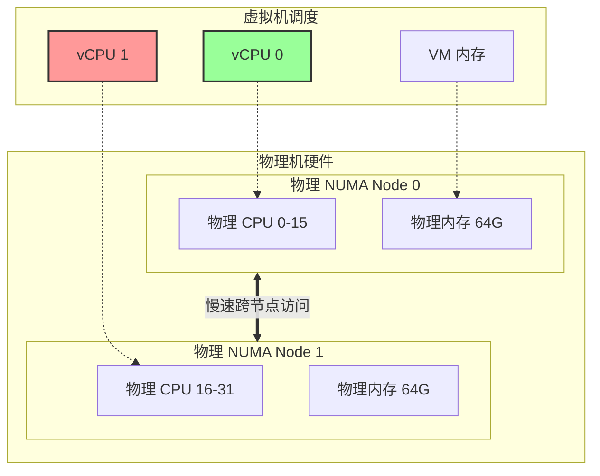

# vCPU、物理 CPU 与 NUMA 的三角关系

**核心结论：vCPU 本质是宿主机上的线程，它跑在哪个 NUMA 节点上，决定了它访问内存是"快"（本地）还是"慢"（远程）。**

---

## 1. 概念映射

*   **物理 CPU (pCPU)**：真实的硬件核心。
*   **vCPU**：虚拟机看到的 CPU，本质是 Hypervisor (如 KVM) 在宿主机上创建的一个**线程**。
*   **NUMA 节点**：物理 CPU + 直连的物理内存。

## 2. vCPU 与 NUMA 的相互影响

### 场景一：理想情况 (Local Access)
*   **调度**：vCPU 线程被调度器固定在 **NUMA Node 0** 的物理核上运行。
*   **内存**：虚拟机的内存也全部分配在 **NUMA Node 0** 的物理内存条上。
*   **结果**：vCPU 访问内存是**本地访问**，速度极快，延迟低。

### 场景二：糟糕情况 (Remote Access)
*   **调度**：vCPU 线程被调度到了 **NUMA Node 1** 的物理核上（可能是因为 Node 0 忙）。
*   **内存**：虚拟机的内存仍然在 **NUMA Node 0** 上。
*   **结果**：vCPU 必须跨越 QPI/UPI 总线去访问 Node 0 的内存。
    *   **延迟增加**：访问速度慢 30%-50%。
    *   **总线拥堵**：占用了宝贵的跨节点带宽，影响其他 VM。

### 场景三：最差情况 (Split Memory)
*   **内存**：虚拟机分配了 64G 内存，但 Node 0 只剩 32G，于是剩下 32G 分配到了 Node 1。
*   **结果**：无论 vCPU 跑在哪个节点，都有 50% 的概率是远程访问。性能极不稳定。

## 3. vCPU 之间的影响

同一个 VM 的多个 vCPU 之间也会互相拖累：

*   **跨节点调度**：如果 VM 有 2 个 vCPU，vCPU-0 跑在 Node 0，vCPU-1 跑在 Node 1。
    *   如果它们需要共享数据（访问同一块内存），必然有一个是远程访问。
    *   操作系统内核锁（Spinlock）会因为跨节点通信延迟变大而显著降低效率。

## 4. 解决方案：vNUMA (Virtual NUMA)

为了解决这个问题，Hypervisor 可以将物理 NUMA 拓扑"透传"给虚拟机。

*   **没有 vNUMA**：虚拟机以为自己是一台普通的 UMA 机器，Guest OS 随意调度进程，可能导致性能下降。
*   **开启 vNUMA**：
    1.  虚拟机内部也能看到 2 个虚拟 NUMA 节点。
    2.  Guest OS（如 Linux/Windows）会智能地将进程和内存绑定在同一个虚拟节点内。
    3.  Hypervisor 保证虚拟节点严格映射到物理节点。

## 5. 总结图解

### 最佳实践
对于高性能需求的 VM（如数据库）：
1.  **CPU Pinning**：将 vCPU 严格绑定到特定物理 NUMA 节点的 CPU 上。
2.  **内存绑定**：强制内存只从该 NUMA 节点分配。
3.  **vNUMA**：如果 VM 规格超过单个 NUMA 节点的容量，开启 vNUMA 让 Guest OS 感知并优化。
